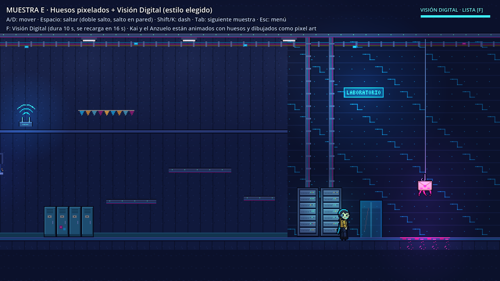
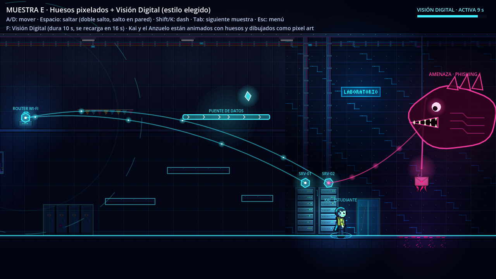
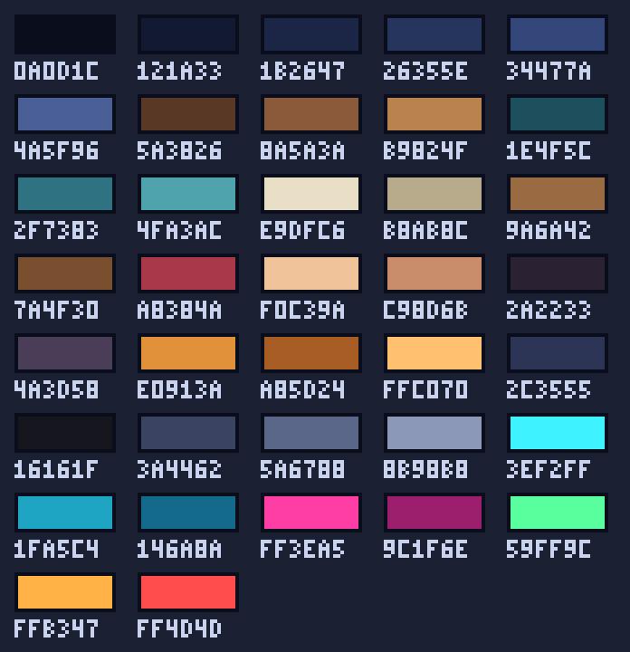
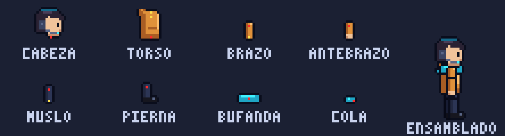

# Guía de arte · Escudo Escolar: Defensa Cibernética

Documento vivo de la dirección de arte. Si algo cambia (paleta, tamaños, estilo), se actualiza aquí.

> **En una frase:** el colegio es un mundo físico en **pixel art**, los personajes se animan con
> **huesos pero se dibujan como pixel art**, y la **Visión Digital** revela la red por dentro en
> **estilo vectorial**.

| Mundo físico (lo que se ve) | Mundo digital (Visión Digital) |
|---|---|
|  |  |

Referencia jugable: `prototypes/estilos/huesos_pixelados/muestra_huesos_pixelados.tscn` (F6 en Godot).

---

## 1. Los dos mundos

| | Mundo físico | Mundo digital |
|---|---|---|
| Qué representa | El colegio tal como lo ven estudiantes y docentes | La red por dentro: datos, conexiones y amenazas |
| Técnica | Pixel art (escenarios) + huesos pixelados (personajes) | Formas vectoriales y neón, dibujadas por código |
| Sensación | Cálido, reconocible, cotidiano | Frío, luminoso, abstracto |
| Las amenazas se ven como… | Algo "raro" pero inofensivo (un correo extraño, un USB tirado) | Su **forma real**: criaturas que roban, bloquean o espían |

Esta diferencia es la idea central del juego: **lo que parece inofensivo en el mundo físico puede
ser peligroso en la red.** Mantenerla clara en el arte es lo más importante de esta guía.

---

## 2. Especificaciones técnicas

| Tema | Valor |
|---|---|
| Resolución del arte | **640×360** (la cámara tiene zoom ×2 sobre 1280×720) |
| Tiles | **16×16 px** |
| Kai | ~**36 px** de alto con el pelo |
| Formato | PNG con transparencia, sin compresión con pérdida |
| Antialiasing | **Nunca** en el pixel art: bordes duros, píxeles enteros |
| Semitransparencias | Solo en efectos (luz, vidrio, hologramas), no en personajes ni tiles |
| Contorno | 1 px con el color `#0A0D1C` (no negro puro) |
| Luz principal | Desde **arriba a la izquierda** |
| Orientación | Personajes y piezas dibujados **mirando a la derecha** (el juego los voltea) |
| Filtro en Godot | Nearest (ya está configurado en las salas) |

---

## 3. Paleta

Archivos para importar en tu programa de dibujo:
- `assets/art/paleta.gpl` → Pixelorama, Aseprite y Krita la abren como paleta.
- `assets/art/paleta.png` → un píxel por color.

| Grupo | Colores | Uso |
|---|---|---|
| Noche | `0A0D1C` `121A33` `1B2647` `26355E` `34477A` `4A5F96` | Paredes, suelos, sombras. Base de todo el escenario |
| Colegio (cálidos) | `5A3826` `8A5A3A` `B9824F` · `1E4F5C` `2F7383` `4FA3AC` · `E9DFC6` `B8AB8C` · `9A6A42` `7A4F30` · `A8384A` | Madera, casilleros, papel, corcho, detalles rojos |
| Personas | `F0C39A` `C98D6B` · `2A2233` `4A3D58` · `E0913A` `A85D24` `FFC070` · `2C3555` `16161F` | Piel, pelo, sudadera de Kai, pantalón, zapatos |
| Tecnología | `3A4462` `5A6788` `8B98B8` | Metal: racks, bandejas, routers |
| Red sana | `3EF2FF` `1FA5C4` `146A8A` | Datos, Wi-Fi, interfaz, la bufanda de Kai |
| **Amenaza** | `FF3EA5` `9C1F6E` | **Solo amenazas y corrupción** |
| Luces de estado | `59FF9C` `FFB347` `FF4D4D` | LEDs: correcto / aviso / error |

**Reglas de color**
1. **El magenta es exclusivo de las amenazas.** Si algo es magenta, el jugador debe poder asumir que es peligroso.
2. Lo escolar va en tonos cálidos y apagados; la tecnología, en neón frío. Así se distingue de un vistazo qué es colegio y qué es red.
3. Máximo ~12 colores por sprite. Menos colores = más legible.
4. Si necesitas un color que no está, no lo inventes: proponlo y se agrega aquí para todo el equipo.

---

## 4. Personajes: huesos pixelados

### 4.1 Cómo funciona
1. **Dibujas el personaje por piezas** (cabeza, torso, brazo, antebrazo…) en pixel art.
2. En Godot se arma un **esqueleto** (`Skeleton2D` + `Bone2D`): cada pieza va pegada a un hueso.
3. Las animaciones se hacen moviendo huesos en un `AnimationPlayer` (pocas poses clave; Godot interpola).
4. El personaje se dibuja a **la resolución del pixel art** (técnica de `PixelatedRig`), así que al girar las piezas nunca se ve borroso: sigue pareciendo pixel art.

Ventaja: **cada personaje se dibuja una sola vez**. Agregar una animación nueva no requiere dibujar más.

### 4.2 Tamaños

| Personaje | Alto aproximado | Notas |
|---|---|---|
| Kai | 36 px | Protagonista |
| Estudiantes | 32–36 px | Variantes de las piezas de Kai (otra paleta, peinado, accesorio) |
| Docentes y administrativos | 40–44 px | Proporciones de adulto: cabeza más pequeña respecto al cuerpo |
| Enemigos comunes | 16–32 px | Siluetas simples y muy legibles |
| Jefes | 64–128 px | Muchas piezas; aquí los huesos ahorran más trabajo |

> La caja de colisión actual del jugador es 10×22 px (de la escena de tu compañero). Con Kai de
> 36 px conviene acordar una nueva, cerca de **12×30 px**.

### 4.3 Kai por piezas

Plantilla editable a tamaño real: **`assets/art/characters/kai/kai_piezas.png`**. Ábrela, dibuja
encima respetando el tamaño de cada pieza y guarda con el mismo nombre.

● rojo = **pivote** (punto de giro; se une a la pieza padre) · ● amarillo = **articulación** (donde se une la pieza hija)

| Pieza | Lienzo | Pivote (se une a…) | Articulaciones |
|---|---|---|---|
| Cabeza | 16×16 | (8, 14) → cuello del torso | — |
| Torso | 12×14 | (6, 12) → cadera (raíz del esqueleto) | cuello (6, 1) · hombro (6, 3) |
| Brazo | 7×9 | (3, 2) → hombro | codo (3, 7) |
| Antebrazo + mano | 7×9 | (3, 2) → codo | — |
| Muslo | 7×9 | (3, 2) → cadera | rodilla (3, 7) |
| Pierna + zapato | 9×10 | (3, 2) → rodilla | — |
| Bufanda (cuello) | 11×5 | (5, 2) → cuello | — |
| Cola de la bufanda | 6×4 | (4, 2) → la pieza anterior | Se repite 3–4 veces en cadena |

### 4.4 Reglas para dibujar piezas
1. **Mirando a la derecha**, en posición neutra (brazos y piernas rectos hacia abajo).
2. **Extremos redondeados en las articulaciones:** el codo, la rodilla y el hombro deben verse bien en cualquier ángulo. Si un extremo es cuadrado, al girar aparecen huecos.
3. **Solapa las piezas 1–2 px** en cada unión. Mejor que sobre a que falte.
4. **Contorno en cada pieza,** excepto en la parte que queda tapada por la unión.
5. **Las extremidades de atrás reutilizan la misma pieza,** solo que más oscura (el juego lo hace solo). No dibujes dos brazos.
6. **Detalles grandes y pocos:** a 36 px, un ojo es 1×2 px. La silueta tiene que leerse sin colores.
7. Deja **1 px de margen** transparente alrededor de cada pieza (para el contorno).
8. No cambies el tamaño del lienzo de una pieza sin avisar: los pivotes dependen de él.

### 4.5 Animaciones necesarias (Kai)

| Animación | Cuándo | Bucle | Poses clave |
|---|---|---|---|
| Quieto (`idle`) | Sin moverse | Sí | Respiración: subir/bajar el torso 1 px |
| Correr (`run`) | Moviéndose | Sí | Contacto · paso · contacto · paso |
| Saltar (`jump`) | Subiendo | No | Rodilla arriba, brazos arriba |
| Caer (`fall`) | Bajando | Sí | Piernas colgando, brazos abiertos, bufanda hacia arriba |
| Aterrizar (`land`) | Al tocar el suelo | No | Agacharse y volver |
| Dash | Dash | No | Cuerpo inclinado, brazos atrás, bufanda horizontal |
| Deslizar en pared (`wall`) | Pegado a una pared | Sí | Espalda contra la pared, una mano apoyada |
| Doble salto | Segundo salto | No | Giro o impulso con las piernas recogidas |
| Interactuar | Usar terminal o hablar | No | Brazo extendido |
| Ataque (Pulso Digital) | Atacar | No | Brazo hacia adelante + efecto (lo hago por código) |
| Daño (`hurt`) | Recibir daño | No | Retroceso, parpadeo |

La bufanda-cable se mueve sola por código (física simple): no hace falta animarla a mano.

### 4.6 Diseño de Kai
- **Quién es:** estudiante del club de ciberseguridad del colegio.
- **Silueta reconocible:** pelo oscuro despeinado, **auriculares con micrófono** y una **bufanda-cable cian** que flota detrás (deja ver el movimiento y la dirección).
- **Sudadera ámbar:** contrasta con el fondo azul noche y lo distingue de inmediato. *(El dibujo provisional de tu compañero usa sudadera azul: el color final se acuerda en equipo.)*
- Expresión simple: un ojo de 1×2 px; la personalidad se transmite con la pose.

### 4.7 NPC
Se construyen **reutilizando piezas** de Kai o de un adulto base:
- **Estudiantes:** cambio de paleta (sudadera, pelo), otro peinado (solo cambia la cabeza) y un accesorio (mochila, gorra, tableta).
- **Docentes:** cuerpo adulto con camisa, cordón con credencial y una taza o una carpeta.
- **Administrativos:** chaleco o blazer, gafete, auriculares de oficina.

Cada NPC importante necesita: `idle`, `talk` (gestos con los brazos) y, si camina, `walk`.

---

## 5. Escenarios

### 5.1 Tiles
- **16×16 px**, un tileset por zona (`assets/art/tiles/<zona>_tiles.png`).
- Cada tileset debería tener como mínimo:
  - Suelo: borde superior, relleno, esquinas izquierda y derecha.
  - Pared: lisa, con variaciones, moldura y zócalo.
  - Techo: con bandeja de cables.
  - Plataforma de un sentido (se atraviesa desde abajo).
  - 2–3 variantes de los tiles más repetidos, para que no se note el patrón.
- Tu compañero usa `TileMapLayer`: se pinta la sala con el mouse en el editor.

### 5.2 Capas de profundidad (de atrás hacia adelante)
1. **Fondo lejano** (parallax): ventanas a la ciudad, siluetas de edificios.
2. **Pared**: tiles de pared y objetos de pared (pizarras, carteles, ventanas).
3. **Objetos**: casilleros, mesas, racks (sin colisión, solo decoración).
4. **Juego**: suelo, plataformas, personajes, objetos interactivos.
5. **Primer plano**: siluetas oscuras (cables, columnas) con parallax, para dar profundidad.

### 5.3 Lenguaje visual por zona

| Zona | Infraestructura de TI | Materiales y color | Objetos clave | Amenazas típicas |
|---|---|---|---|---|
| Pasillos | Red cableada, puntos Wi-Fi, cámaras | Baldosas azules, casilleros teal | Casilleros, puertas de aula, carteles, router | USB malicioso, ingeniería social |
| Aulas | Proyector, pizarra digital, PC docente | Madera cálida, pizarra verde oscuro | Pupitres, pizarra, proyector, notas adhesivas | Contraseñas débiles, accesos no autorizados |
| Laboratorio de informática | Estaciones de trabajo, switch, rack pequeño | Pared tecnológica oscura, luz cian | Mesas con PC, sillas, rack, terminal de seguridad | Phishing, malware, USB |
| Biblioteca | PC públicas, Wi-Fi abierta, tabletas | Estantes de madera, luz ámbar | Estanterías, mesas de lectura, PC públicas | Wi-Fi falsa, robo de credenciales |
| Oficinas administrativas | Correo institucional, impresoras, datos personales | Paneles beige, carpetas, luz blanca | Escritorios, archivadores, impresora, teléfono | Ransomware, phishing dirigido, ingeniería social |
| Comedor | Pantallas de menú, pagos digitales, Wi-Fi | Azulejos, colores vivos | Mesas largas, bandejas, pantalla de menú, código QR | QR falsos, saturación (disponibilidad) |
| Sala de servidores | Racks, refrigeración, respaldo eléctrico | Metal, azul frío, LEDs | Racks altos, cableado, aire acondicionado, consola | Vulnerabilidades sin parches, configuraciones inseguras |
| La Nube *(propuesta)* | Servicios en la nube | Casi todo vectorial, flotante | Plataformas de datos, nodos de servicios | Ataques a la nube, robo de credenciales |

**Las cuentas** de estudiantes, docentes y administrativos se pueden representar como **llaves** o
**credenciales** (iconos de 16×16), que el jugador protege o recupera.

### 5.4 Objetos interactivos
- Deben distinguirse del decorado: un **brillo cian sutil** o un borde de 1 px más claro.
- Al acercarse, el juego muestra el aviso (por código).
- Las computadoras necesitan **3 estados**: normal, sospechosa (glitch magenta en la pantalla) y revisada.

---

## 6. El mundo digital (Visión Digital)

### 6.1 Cómo funciona en el juego
- Tecla **Q**. Dura **10 segundos** y se recarga en **16 segundos** desde que se apaga.
- En los últimos 2 segundos la capa digital **parpadea** para avisar que se acaba.
- Se puede apagar antes con Q; en ese caso la recarga empieza en ese momento.
- La transición tiene un *glitch* de pantalla, y un indicador arriba a la derecha muestra la carga.

### 6.2 Reglas visuales
- **Vectorial puro:** líneas limpias, formas geométricas, brillo (glow). Nada de pixel art ni texturas.
- El mundo físico se **oscurece** y queda como contornos tenues de fondo.
- Grosor de línea: 1–1.5 px a escala de mundo. Cian para lo sano y magenta para las amenazas.
- **Todo lo digital se dibuja por código.** No hay que hacer PNG; lo que necesito de ti son **bocetos de las formas reales de las amenazas** (ver sección 7).

### 6.3 Qué revela

| En el mundo físico | En el mundo digital |
|---|---|
| Router Wi-Fi | Nodo con su **área de cobertura** |
| Cables y canaletas | **Enlaces** con paquetes de datos viajando |
| Servidores | Nodos hexagonales con nombre (SRV-01…) |
| Estudiantes y docentes | Su "firma digital" (anillo y nombre) |
| Un objeto sospechoso | La **forma real** de la amenaza |
| Paredes y suelos | Solo contornos |
| *(nada)* | **Puentes de datos** y secretos que solo existen en la red |

---

## 7. Amenazas

Los nombres vienen de `docs/combate.md`. Las formas son **propuestas** para acordar en equipo.

| Tipo | Enemigo | Forma física (pixel art) | Forma real (digital) |
|---|---|---|---|
| Phishing | El Imitador | Un correo con anzuelo, colgando del techo | **Pez abisal** que usa el correo como carnada *(ya está en la muestra)* |
| Credenciales | El Usurpador | Figura con capucha y un llavero de llaves copiadas | Masa de llaves clonadas que abre puertas que no le corresponden |
| Malware | El Parásito | Manchas de píxeles corruptos en los equipos | Organismo que se ramifica por los cables |
| Ransomware | El Carcelero | Candados que aparecen sobre puertas y archivos | Figura con cadenas que encierra los nodos de la red |
| Disponibilidad | El Enjambre | Pantallas congeladas, luces que parpadean | Enjambre de partículas que satura los enlaces |
| Vulnerabilidad | El Corruptor | Grietas en paredes y servidores | Grietas en la red por donde se filtran datos |
| Ingeniería social | El Suplantador | Un NPC con un detalle que no encaja (glitch sutil) | Figura sin rostro que cambia de máscara |

**Reglas para las amenazas**
- La forma física debe parecer **casi inofensiva**, con un solo detalle extraño (en magenta).
- La forma digital es **la metáfora** del ataque: tiene que explicar qué hace la amenaza sin texto.
- Las dos formas comparten **un elemento reconocible**, como el sobre del Imitador, para que el jugador las relacione.

---

## 8. Interfaz (HUD)
- Fuente pixel art legible, en mayúsculas para títulos. Antes de usar una fuente, revisar que su licencia permita uso libre.
- Iconos de **16×16**: presupuesto, seguridad, confianza, Visión Digital, interactuar, pistas.
- Paneles azul noche (`121A33`) con borde cian (`1FA5C4`). Magenta solo para alertas de amenaza.
- Tu compañero ya tiene un tema de interfaz (`ui/theme/main_theme.tres`): los iconos y paneles deben combinar con él.

---

## 9. Flujo de trabajo

### 9.1 Programas
- **Pixelorama** (gratis, hecho con Godot): recomendado para empezar.
- **Aseprite** (de pago, el estándar en pixel art) o **LibreSprite** (gratis).
- Para bocetos de las formas digitales sirve cualquier programa, incluso papel y lápiz.

### 9.2 Pasos
1. Abre la plantilla o crea un lienzo del tamaño indicado.
2. Importa la paleta (`assets/art/paleta.gpl`).
3. Activa la cuadrícula de 16 px en los tiles y la de 1 px en los personajes.
4. Dibuja siguiendo las reglas de las secciones 3 y 4.
5. Exporta como **PNG** sin escalar (tamaño real, 1×).
6. Guarda en la carpeta correcta (abajo) y haz commit en Git.

### 9.3 Dónde guardar y cómo nombrar
Nombres en minúsculas, sin espacios ni tildes, separados con `_`.

| Qué | Carpeta | Ejemplo |
|---|---|---|
| Piezas de personajes | `assets/art/characters/<personaje>/` | `kai/kai_piezas.png` |
| Tiles | `assets/art/tiles/` | `laboratorio_tiles.png` |
| Objetos | `assets/art/props/<zona>/` | `laboratorio/rack_servidores.png` |
| Amenazas (forma física) | `assets/art/threats/<amenaza>/` | `imitador/imitador_piezas.png` |
| Interfaz | `assets/art/ui/` | `icono_presupuesto.png` |
| Animaciones por cuadros (LEDs, pantallas) | Igual que su objeto, en tira horizontal | `rack_servidores_leds.png` (4 cuadros) |

### 9.4 Lista de revisión antes de entregar un sprite
- [ ] Usa solo colores de la paleta.
- [ ] Sin antialiasing ni píxeles semitransparentes (salvo efectos).
- [ ] Contorno `#0A0D1C` de 1 px.
- [ ] Luz desde arriba a la izquierda.
- [ ] Mirando a la derecha (personajes).
- [ ] Tamaño de lienzo correcto y 1 px de margen (piezas).
- [ ] Se lee bien a tamaño real, no solo ampliado.
- [ ] Nombre y carpeta correctos.

---

## 10. Prioridades

### P1 · Primer nivel jugable (pasillo + laboratorio + phishing)
1. **Kai por piezas**: redibujar la plantilla (9 piezas).
2. **Tileset del pasillo**: suelo, pared, moldura, zócalo, techo con bandeja (~12 tiles).
3. **Tileset del laboratorio**: pared tecnológica, suelo (~8 tiles).
4. **Objetos del pasillo**: casillero (2 variantes), puerta de aula, ventana, corcho, reloj, banderines, lámpara, router.
5. **Objetos del laboratorio**: mesa con PC (3 estados), silla, rack con LEDs (4 cuadros), canaleta, puerta del laboratorio, **terminal de seguridad**.
6. **NPC estudiante** (variante de Kai).
7. **El Imitador, forma física** (piezas: sobre, anzuelo, tentáculos) + **boceto de la forma digital**.
8. **Iconos del HUD**: presupuesto, seguridad, confianza, Visión Digital.

### P2 · Segunda zona y combate
- Tilesets de aula y biblioteca, NPC docente.
- Enemigo patrullero (tarea T5 de tu compañero) y efectos del Escudo MFA.

### P3 · Resto del colegio
- Oficinas, comedor, sala de servidores, La Nube, jefes, el resto de las amenazas.

---

## 11. Por acordar en equipo
- [ ] Color final de la sudadera de Kai (ámbar o azul).
- [ ] Caja de colisión del jugador con Kai de 36 px (propuesta: 12×30).
- [ ] Formas de las amenazas (sección 7).
- [ ] Fuente de la interfaz.
- [ ] Si La Nube será una zona propia.
